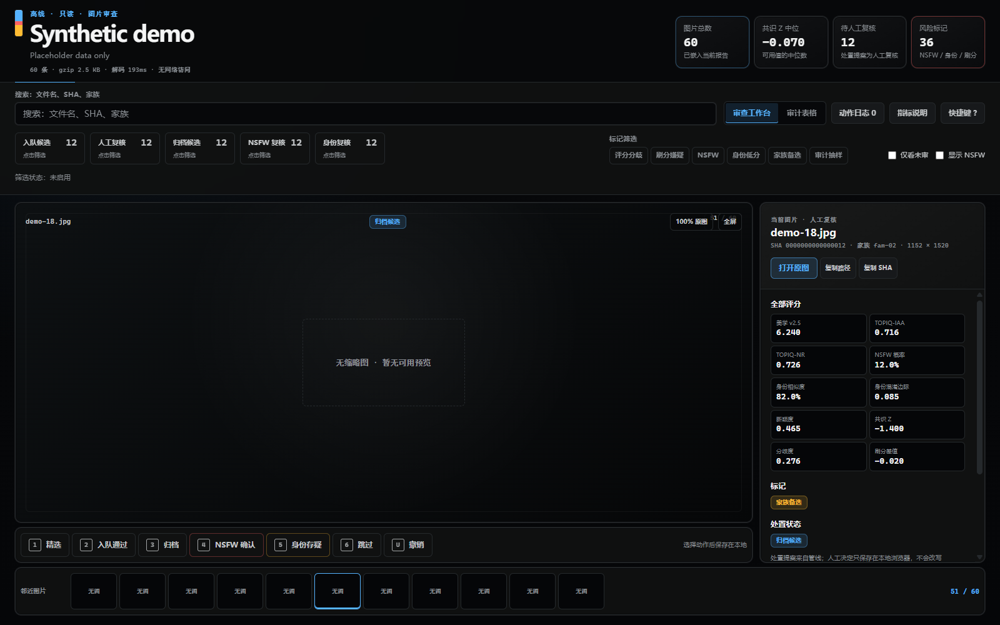
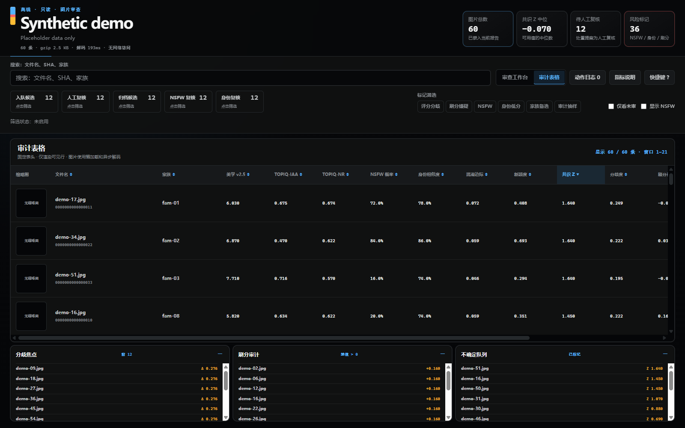
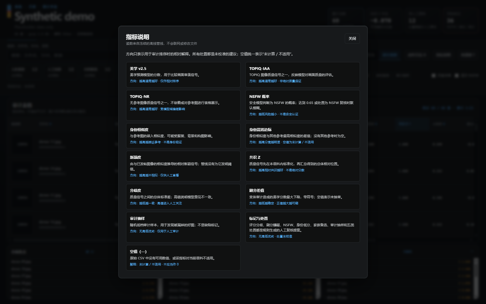

# Art Curator

[English](README.md) · [设计规范](DESIGN.md) · [工作台工具](tools/README.md) · [安全分流与撤销](docs/apply.md)

**完全本地、零训练、纯视觉的图片库整理管线 + 离线人工审查工作台。**
用预训练模型生成可解释的审查队列，不上传图片，不训练自定义模型。

质量、身份相似度和内容风险判断来自解码后的像素，**不依赖文件名、提示词、EXIF
或生成元数据**。路径只用于定位文件、选择数据集角色；内容哈希用于缓存、稳定排序
与抽样。人工可以搜索文件名，但文件名不会进入模型特征。

> 源码采用 **AGPL-3.0-only**。完整推理依赖栈并非无条件可商用：
> **pyiqa 为 PolyForm Noncommercial，仅按其条款用于个人/研究等非商业用途**；
> 模型权重另有许可证。请先阅读 [第三方许可说明](THIRD_PARTY_LICENSES.md)。



## 架构：资格门禁 → 相对排序 → 队列构建与弃权

1. **只读扫描**：严格解码 PNG/JPG/JPEG/WebP，记录内容哈希、清单及缩略图。
2. **视觉信号**：SigLIP 参考相似度、安全分类、美学 v2.5、TOPIQ-IAA、TOPIQ-NR、Q-ReAlign。
3. **资格门禁**：安全/身份分流优先；模型分歧、刷分嫌疑、家族备选等标记阻止直接入队。
4. **相对排序**：四个质量评分器经总体 Z 标准化后等权汇总；处理零方差和缺失分数。
5. **构建队列**：默认 P90 以上且通过其他门禁才成为入队候选；P75 以上或有标记的
   图片进入人工审查。不满足入队门禁时弃权到审查，而非强行给结论。
6. **低分抽查**：较低且无标记的图片仅成为归档候选，其中约 5% 通过确定性哈希抽样
   提升到人工审查。相似家族用连通分量构建；新颖度只展示，不擅自设门槛。

输出 `scores.csv` / `families.json` → 离线工作台 → 人工决定日志。
人工决定与模型的 `proposed_tier` 分开保存。

## 环境与快速开始

完整推理面向 **Python 3.12 / Windows / NVIDIA CUDA GPU**，已使用 CUDA 12.8
轮子和 RTX 5060 Ti 16 GB。没有承诺 CPU 推理回退；Linux CI 只验证纯 Python
图库生成器。请使用可写的源码检出目录，输出必须位于项目内。

在项目根目录运行 PowerShell：

```powershell
$env:PYTHONUTF8='1'
$env:UV_CACHE_DIR="$PWD\.uv-cache"
uv venv --python 3.12 .venv
uv pip install --python .venv\Scripts\python.exe torch==2.11.0 torchvision --index-url https://download.pytorch.org/whl/cu128
uv pip install --python .venv\Scripts\python.exe transformers==4.57.6 pyiqa==0.1.15.post2 aesthetic-predictor-v2-5 ImageHash Pillow numpy PyYAML 'pydantic>=2' accelerate
uv pip install --python .venv\Scripts\python.exe --no-deps -e .
Copy-Item config.example.yaml config.yaml
```

**先编辑 `config.yaml`**：将所有占位路径替换为输入库、参考集、已发布图片集、
主题根目录的实际位置。此配置不提交到仓库；建议输出保持为 `out/library`。
自己的参考集不能为空。其他主题参考集的自动发现仍使用历史约定 `*参考图集*`；
没有这类目录时混淆边际为空。这只是数据角色发现，不是基于目录文字评分。

Q-ReAlign 使用独立环境，避免新版 Transformers 改变主环境美学分数：

```powershell
uv venv --python 3.12 .venv-qrealign
uv pip install --python .venv-qrealign\Scripts\python.exe torch==2.11.0 torchvision --index-url https://download.pytorch.org/whl/cu128
uv pip install --python .venv-qrealign\Scripts\python.exe pyiqa==0.1.16 transformers==5.17.0 'pydantic>=2' ImageHash
uv pip install --python .venv-qrealign\Scripts\python.exe --no-deps -e .
```

### 模型下载与执行

首次评分会联网下载 SigLIP、美学 v2.5、TOPIQ、`Falconsai/nsfw_image_detection`
及 `q-future/Q-ReAlign-Mini-0.8B` 等权重，**不会上传图片**。Q-ReAlign 固定版本为
`fe1f45a7574c9e9d908875af9f7e90cb946aa19f`；其他 Hugging Face 模型首次解析后记录
不可变 revision。权重与预处理指纹参与缓存键。共享权重位于
`out/library/cache/{huggingface,torch}`，预测缓存属于各次运行。

```powershell
.venv\Scripts\python.exe -m artcurator.cli run-all --config config.yaml --out out/smoke --limit 12
.venv\Scripts\python.exe -m artcurator.cli run-all --config config.yaml --out out/library
.venv\Scripts\python.exe -m artcurator.cli previews --out out/library
.venv\Scripts\python.exe tools/build_gallery.py --out out/library
```

所有权重及 revision 均已缓存后，可设置 `HF_HUB_OFFLINE=1`、
`TRANSFORMERS_OFFLINE=1` 断网运行；缓存缺失应报错，不能改用云端推理。

| 命令 | 功能 |
|---|---|
| `scan` | 严格解码、哈希、清单和缩略图 |
| `score` | 嵌入、参考信号、质量/安全分数、变体审计 |
| `cluster` | 共识、家族、标记和处置建议 |
| `report` | CSV、摘要和溯源 |
| `run-all` | scan → score → cluster → report，不含预览/图库 |
| `previews` | 从已有清单生成最长边不超过 1024px 的无元数据 JPEG |

公共参数为 `--input`、`--out`、`--config`、`--limit`。扫描仍先检查整个库再按
SHA 排序取限量；其他阶段使用已保存的清单。`score --pass` 支持 `siglip`、
`aes_v25`、`topiq_iaa`、`topiq_nr`、`qrealign`、`nsfw_prob`。
中断后重复同一评分命令续跑，再执行 cluster/report。**不要为续跑重新 scan**，
因为它会开始新清单。输出数据库、嵌入、CSV、缩略图、日志和缓存均是私有本地产物。

## 离线人工工作台

主界面是**大图预览 + 指标检查栏 + 六动作操作带 + 邻近图片胶片条**。当前 UI
为中文。人工决定和追加动作日志按语料指纹保存在浏览器 `localStorage`，支持
JSON/CSV 导出，不覆盖评分 CSV，也不直接执行文件移动。请定期导出，浏览器存储不是备份。

- `← →` / `J K`：前后浏览；`1–6`：精选、入队通过、归档、确认风险、身份存疑、跳过。
- `U`：撤销当前图片动作；空格：适合窗口/100%；`F`：全屏；`?`：快捷键帮助。
- 次级**虚拟化表格**保留全部指标、排序、筛选和家族详情，指标说明明确展示局限。
- 数据以短键列式 JSON + gzip/base64 内嵌；浏览器通过原生
  **`DecompressionStream("gzip")`** 解码。无框架、CDN 或云服务，建议使用新版
  Chrome/Edge；不支持时显示明确错误。




无需模型和图片即可试用仓库内的 **60 行合成占位示例**：

```powershell
python tools/build_demo.py
python -m http.server 8765 --bind 127.0.0.1 --directory tests/fixtures/gallery
```

访问 `http://127.0.0.1:8765/gallery.html`。只服务示例目录，不要暴露整个项目或图片库。
真实图库也可直接本地打开；HTTP 页面打开原始本地文件可能受到浏览器策略限制。

## 安全模型

- 整理评分阶段**只读语料**，PNG 辅助元数据在解码前剥离，但保留像素透明度。
- Python 审计钩子限制写入项目内；它不是防恶意原生代码或并发替换的 OS 沙盒。
- 独立 `artcurator.apply` **默认 dry-run**，只生成计划。执行必须持有未变更的计划、
  CSV 摘要与人工确认令牌。
- 显式移动采用 **复制 → fsync → 两端哈希校验 → 写撤销账本 → unlink 源副本**；
  碰撞不覆盖，undo 逆序恢复，失败/部分副本保留供检查。
- **绝不把删除作为筛选决定**：归档只是候选。显式移动和撤销确实会移除已校验的
  冗余源副本，并不等于“没有 unlink”。仍须独立备份，不能保证外部篡改后无条件恢复。

详见 [安全分流与恢复契约](docs/apply.md)。不要从不同输出目录并发操作同一语料。

## 已测性能

- 历史 300 图对比：扫描含缩略图/清单 **50.048s → 12.448s，4.02×**；
  安全推理 **21.059s → 17.694s，1.19×**，不含模型加载和预热。
- 不同报告/合成示例的载荷降幅约 **66–90%**，取决于数据与 gzip/base64 统计边界；
  先前较大报告的嵌入载荷约减少 73%。不能直接等同于整个 HTML 的降幅。
- 有界 CPU 预处理与单 GPU 推理重叠；虚拟行、有限邻图预取降低浏览器开销。

这是历史单次顺序对照，不是所有平台保证；OS 缓存会影响结果。私有路径、语料及
原始证据不公开。方法与限制见 [性能说明](docs/pipeline/wave2.md)。

## 诚实的局限

没有人工标签就没有校准后的准确率/召回率；相对分数随语料变化，百分位不是质量概率。
**NSFW 分类器不是安全认证**，相似度也不是身份验证。“零训练”指本工作流不微调，
并不意味着预训练模型没有训练数据偏差。插画域可能超出模型可靠范围。

主环境为避免分数漂移固定 Transformers，但没有完整依赖锁文件；升级必须重测。
Q-ReAlign 使用 Windows 风格解释器路径，Linux GPU 推理未经保证。连通分量端点
不一定满足两两相似门槛，家族构建为平方复杂度，预取只限制对象数量而非 RAM 字节。
已有预览即使损坏也会跳过；共享模型缓存固定在 `out/library`。
CI 只运行无需模型的图库测试，不证明 GPU 精度、性能、许可证合规或真实语料恢复能力。

## 开发与许可

最小测试环境仅需 pytest，见 [贡献指南](CONTRIBUTING.md)。
Copyright © 2026 XucroYuri。项目源码按 [AGPL v3](LICENSE)（`AGPL-3.0-only`）发布，
不提供担保；第三方依赖、模型和待处理图片保留各自权利。
